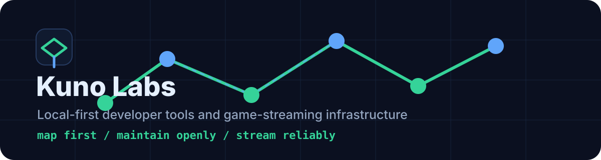

# Kuno Labs

Local-first developer tools for AI coding agents.

We build compact, inspectable systems that help agents understand a repository before they spend a large context window reading it. The focus is practical: smaller prompts, clearer maps, safer local artifacts, and tooling that stays fast enough to use during real work.

## Active Project

| Project | Status | Focus |
| --- | --- | --- |
| [CodePrism](https://github.com/kunolabs/codeprism) | Alpha | Local codebase maps, focused context slices, and optional visual replay for AI coding agents. |

Early local runs have reduced estimated source context by roughly 78-99% depending on repo size and query scope. The numbers are estimates, but the workflow is simple: map first, slice next, read raw files only when they matter.

## What We Care About

- Local-first tools with no network calls by default.
- Inspectable text, JSON, SQLite, and HTML artifacts.
- Deterministic static parsing before model-generated summaries.
- Measured benchmarks over viral claims.
- Cross-platform CLI behavior for Windows, macOS, and Linux.

## Links

- [CodePrism repository](https://github.com/kunolabs/codeprism)
- [CodePrism README](https://github.com/kunolabs/codeprism#readme)
